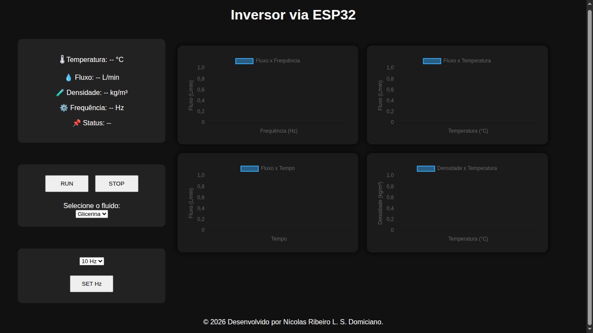

# Frequency-Inversor

O projeto foi desenvolvido com o objetivo de automatizar um sistema de bombeamento hidráulico utilizando uma ESP32 conectada via Wi-Fi e um inversor de frequência para o acionamento e controle da bomba.

## Funcionalidades

- Acionamento remoto da bomba hidráulica.
- Controle através de inversor de frequência.
- Monitoramento de temperatura em tempo real.
- Monitoramento de fluxo/vazão.
- Interface web para supervisão e operação.
- Comunicação via rede Wi-Fi.
- Sistema de proteção baseado nos parâmetros monitorados.

## Hardware Utilizado

- ESP32
- Inversor de Frequência
- Sensor de Temperatura
- Sensor de Fluxo/Vazão
- Módulo Relé (quando aplicável)
- Fonte de Alimentação

## Tecnologias Utilizadas

- C++
- Arduino Framework
- ESPAsyncWebServer
- Wi-Fi (ESP32)
- HTML/CSS/JavaScript

## Aplicação

O sistema foi projetado para permitir o monitoramento e controle remoto de bombas hidráulicas, fornecendo informações operacionais em tempo real e possibilitando a automação do processo de acionamento através de uma interface web acessível pela rede local.

## Benefícios

- Maior eficiência operacional.
- Monitoramento contínuo dos parâmetros críticos.
- Facilidade de operação.
- Redução de intervenções manuais.
- Possibilidade de expansão para sistemas IoT.

## Autor

Desenvolvido por **Nícolas Ribeiro L. S. Domiciano**

© 2026 - Todos os direitos reservados.

---

## Interface do Sistema

